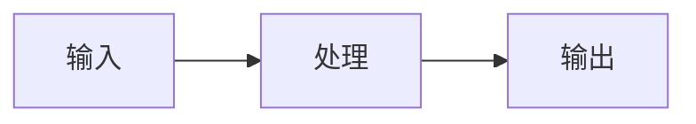

# AGENTS.md — Slidev Starter Seeed

> AI 协作指南：帮助 AI 工具理解如何生成符合 Seeed 品牌规范的幻灯片。

## 项目结构

```
slides.md          # 幻灯片主文件（Markdown）
theme/             # Seeed 主题（git submodule，勿修改）
assets/            # 图片、视频等素材
package.json       # 依赖配置
```

## 包管理器

**始终使用 pnpm。**

## Frontmatter

```yaml
---
theme: ./theme
title: '演讲标题'
colorSchema: light
transition: slide-left
mdc: true
drawings:
  persist: false
layout: cover
---
```

## 布局规则

| 场景 | layout | 说明 |
|------|--------|------|
| 封面 | `cover` | 支持 `image` 背景图 |
| 章节页 | `section` | 居中 + 绿色下划线 |
| 常规内容 | `default`（可省略） | 标题 + 绿色分割线 + 内容 |
| 双栏 | `two-cols` | 支持 `leftWidth` 属性 |
| 双栏带标题 | `two-cols-header` | |
| 演讲者介绍 | `intro` | |
| 结尾 | `center` 或 `end` | |

## 组件

```html
<SeeedBadge icon="i-carbon:calendar">2026.03.14 · 深圳</SeeedBadge>

<SeeedCard icon="i-carbon:chip" title="模块名称" color="green">
  描述内容
</SeeedCard>
<!-- color: "green"（默认）| "navy" | "white" -->
```

## 品牌色

- **Seeed Green**: `#8FC31F`（高亮、强调）
- **Studio Navy**: `#003A4A`（深色背景）

## 图标

使用 Iconify：`i-carbon:*`、`i-mdi:*`

```html
<div i-carbon:user-avatar text-2xl />
```

## 素材

- 图片放 `assets/` 目录
- 引用：`` 或 `:src="'./assets/xxx.png'"`
- 文件名：小写、连字符（`product-demo.png`）

## 动画

```html
<v-clicks>
- 第一项
- 第二项
</v-clicks>

<div v-click="1">点击后出现</div>
```

## 演讲者备注

每页**必须**有 `<!-- ... -->` 备注。写提示词，不写逐字稿。

## 语气

分享者视角，不是讲师。用「我个人的理解是…」「不知道大家有没有关注到…」这类表达。

## Mermaid 图表

直接用代码块，无需配置：

````

````

## 运行

```bash
pnpm install
pnpm dev        # 开发预览
pnpm export     # 导出 PDF
pnpm build      # 导出 SPA 网页
```
