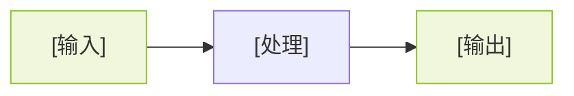

# 演讲主标题

  副标题 · 一句话定位这次分享

  <SeeedBadge icon="i-carbon:calendar">YYYY.MM.DD · 活动名称</SeeedBadge>
  <SeeedBadge icon="i-carbon:location">深圳</SeeedBadge>

  [你的名字] · 矽递科技

<!--
开场白：「今天想和大家分享…」
-->

---
layout: intro
class: pl-30
---

# [你的名字]

  [你的职位] · 矽递科技 / Seeed Studio

  <SeeedBadge>关键词一</SeeedBadge>
  <SeeedBadge>关键词二</SeeedBadge>
  <SeeedBadge>关键词三</SeeedBadge>

  

    

    github.com/[你的 GitHub]
  

  

    

    [你的网站]
  

<!-- 头像：放 ./assets/avatar.jpg，不存在时自动隐藏 -->

  头像

<!--
自我介绍：一句话带过
-->

---
layout: center
---

「今天想和大家分享两段最近的实践和观察」

<v-clicks>

- [分享点一]
- [分享点二]

</v-clicks>

<!--
谦虚定调：不是来教大家的，是来分享实践的
-->

---

# [问题陈述标题]

> [核心问题一句话]

<v-clicks>

- [问题维度一]
- [问题维度二]
- [为什么现有方案不够好]

</v-clicks>

<!--
「我们团队最近遇到了一个问题…」轻描淡写，不要像在推销
-->

---

# 方案概览

  <SeeedCard icon="i-carbon:chip" title="[模块一]">
    [模块一的简短描述，一两句话]
  </SeeedCard>
  <SeeedCard icon="i-carbon:cloud" title="[模块二]" color="navy">
    [模块二的简短描述，一两句话]
  </SeeedCard>
  <SeeedCard icon="i-carbon:code" title="[模块三]" color="white">
    [模块三的简短描述，一两句话]
  </SeeedCard>

<!--
用卡片展示方案的三个核心模块，不要超过三个
-->

---
layout: two-cols-header
leftWidth: 48
---

::header::
# 前后对比

::left::

**之前 (Before)**

- [痛点一]
- [痛点二]
- [痛点三]

::right::

**之后 (After)**

- [改善一]
- [改善二]
- [改善三]

<!--
对比要具体，数字化最好
-->

---

# 系统架构

[替换为实际架构图或 Mermaid 流程图]

<!--
「方案不复杂，核心就是…」简单带一下架构
-->

---
layout: end
---

# 谢谢 · 欢迎交流讨论

  [你的名字] · 矽递科技 / Seeed Studio

  

    

      
    

    官网
  

  

    

      
    

    微信
  

<!--
谢谢，开放讨论
-->
